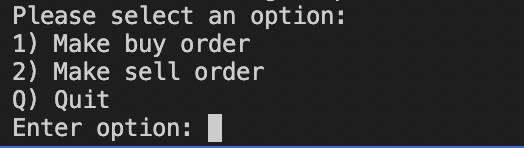
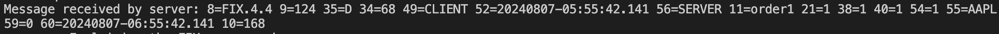
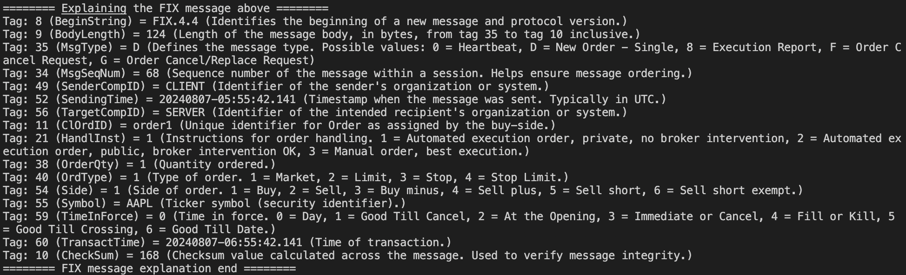

# FIX demonstration app

## Overview
The FIX demonstration app is an interactive console application, written in C# and the .NET framework, intended to showcase the basics of the FIX API protocol utilised for the exchange of information relating to financial markets and transactions. The QuickFIX/n (https://github.com/connamara/quickfixn) FIX engine is used to setup a client and server and exchange FIX messages between them.

## Running
### Pre-requisites
.NET installed

### How to run
Open a terminal window and follow these steps: 
1. Navigate to the FixDemonstrationApp directory
2. Execute the command `dotnet run`

This will start the app. A heartbeat FIX message is usually sent at this point so some output relating to this will be shown. Below this, you should see the the following:

The three options are presented are: 
- `1) Make Buy Order` - this sends a FIX message for a buy order from the client to the server to carry out an order of an asset
- `2) Make Sell Order` - this sends a FIX message for a sell order from the client to the server to carry out an order of an asset
- `Q) Quit` - stops the client and server and exits the application

Selecting e.g. `1) Make Order` will send the FIX message, and this will be logged to the terminal e.g.

Following this a message will be output breaking down and explaining the tags in the message:

The options will then display again.

The client sends regular heartbeat messages to monitor the status of the link with the server - these messages are also similarly output to the terminal and interpreted.
