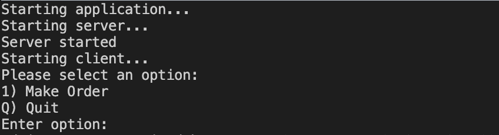
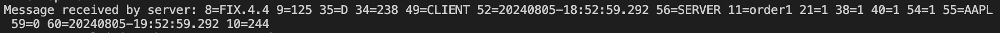
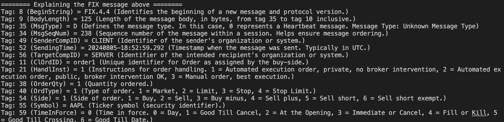

# FIX demonstration app

## Overview
The FIX demonstration app is an interactive console application, written in C# and the .NET framework, intended to showcase the basics of the FIX API protocol utilised for the exchange of information relating to financial markets and transactions. The QuickFIX/n (https://github.com/connamara/quickfixn) package, an implementation of the FIX API protocol for .NET.

## Running
### Pre-requisites
.NET installed

### How to run
Open a terminal window and follow these steps: 
1. Navigate to the FixDemonstrationApp directory
2. Execute the command `dotnet run`

This will start the app. You should see the following messages:

These indicate that the application has started and a server (receiving FIX messages) and a client (sending FIX messages) have been initialised.

Two options are presented: 
- `1) Make Order` - this sends a FIX message from the client to the server to carry out an order of an asset
- `Q) Quit` - stops the client and server and exits the application

Selecting `1) Make Order` will send the FIX message, and this will be logged to the terminal e.g.

Following this a message will be output breaking down and explaining the tags in the message:

The options will then display again.

The client sends regular heartbeat messages to monitor the status of the link with the server - these messages are also similarly output to the terminal and interpreted.
